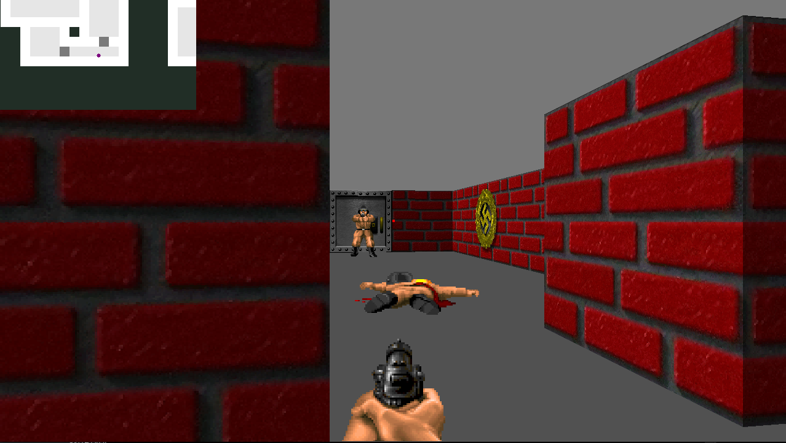

<div align="center">
<h1 align="center">

<br>
42-cub3d  <a href="https://github.com/JaeSeoKim/badge42"></a>
</h1>
<h3 align="center">📍 Get lost in the world of 42-cub3d-where code and creativity collide!</h3>
<h3 align="center">⚙️ Developed with the software and tools below:</h3>

<p align="center">


</p>
</div>

---

## 📍 Overview

<p align="center">
  
</p>
 Cub3D is a project inspired by the game Wolfenstein3D, which is considered the first-ever developed first-person shooter (FPS). It explores the technique of ray-casting and challenges you to create a dynamic view within a maze where you need to find your way.
---

## 💫 Features

- Collision with walls for a more realistic gaming experience.
- Mini-map to visualize the structure of the maze.
- Openable/closable doors to add interactions.
- Animations with animated sprites to bring the game to life.
- View rotation using the mouse for a more immersive exploration.
- Enemies

---


## 📂 Project Structure


```bash
repo
├── Makefile
├── README.md
├── en.subject.pdf
├── img
│   └── cub.png
├── includes
│   ├── colors.h
│   ├── cub3d.h
│   ├── keycodes.h
│   └── sprites.h
├── libft
│   ├── Makefile
│   ├── gnl
│   │   ├── get_next_line.c
│   │   └── get_next_line_utils.c
│   ├── includes
│   │   ├── libft.h
│   │   └── printf.h
│   ├── list
│   │   ├── ft_lstadd_back.c
│   │   ├── ft_lstadd_front.c
│   │   ├── ft_lstaddsort.c
│   │   ├── ft_lstclear.c
│   │   ├── ft_lstdelone.c
│   │   ├── ft_lstiter.c
│   │   ├── ft_lstlast.c
│   │   ├── ft_lstmap.c
│   │   ├── ft_lstnew.c
│   │   └── ft_lstsize.c
│   ├── math
│   ├── mem
│   │   ├── ft_bzero.c
│   │   ├── ft_calloc.c
│   │   ├── ft_memchr.c
│   │   ├── ft_memcmp.c
│   │   ├── ft_memcpy.c
│   │   ├── ft_memmove.c
│   │   └── ft_memset.c
│   ├── print
│   │   ├── ft_putchar_fd.c
│   │   ├── ft_putendl_fd.c
│   │   ├── ft_putnbr_fd.c
│   │   └── ft_putstr_fd.c
│   ├── stdlib
│   │   ├── ft_atobyte.c
│   │   ├── ft_atoi.c
│   │   ├── ft_atol.c
│   │   └── ft_itoa.c
│   └── string
│       ├── ft_free_split.c
│       ├── ft_isalnum.c
│       ├── ft_isalpha.c
│       ├── ft_isascii.c
│       ├── ft_isdigit.c
│       ├── ft_isprint.c
│       ├── ft_size_split.c
│       ├── ft_split.c
│       ├── ft_splitcharset.c
│       ├── ft_strchr.c
│       ├── ft_strcmp.c
│       ├── ft_strdup.c
│       ├── ft_striteri.c
│       ├── ft_strjoin.c
│       ├── ft_strlcat.c
│       ├── ft_strlcpy.c
│       ├── ft_strlen.c
│       ├── ft_strmapi.c
│       ├── ft_strncmp.c
│       ├── ft_strnstr.c
│       ├── ft_strrchr.c
│       ├── ft_strtrim.c
│       ├── ft_substr.c
│       ├── ft_tolower.c
│       └── ft_toupper.c
├── sprites[..]
├── srcs
│   ├── colors.c
│   ├── create_img.c
│   ├── dda.c
│   ├── draw_sprite.c
│   ├── game.c
│   ├── gun.c
│   ├── handle_mouse.c
│   ├── hook_direction.c
│   ├── hook_direction_2.c
│   ├── hook_door.c
│   ├── hook_key_action.c
│   ├── hook_move.c
│   ├── init.c
│   ├── load_textures.c
│   ├── main.c
│   ├── minimaps.c
│   ├── mlx_img_utils.c
│   ├── mouse_utils.c
│   ├── parsing_bonus
│   │   ├── check_color.c
│   │   ├── debug_parsing.c
│   │   ├── exit.c
│   │   ├── info_utils.c
│   │   ├── load_info.c
│   │   ├── loading_maps.c
│   │   ├── maps_utils.c
│   │   └── parsing.c
│   ├── parsing_mandatory
│   │   ├── check_color.c
│   │   ├── debug_parsing.c
│   │   ├── exit.c
│   │   ├── info_utils.c
│   │   ├── load_info.c
│   │   ├── loading_maps.c
│   │   ├── maps_utils.c
│   │   └── parsing.c
│   ├── quit.c
│   ├── raycasting.c
│   ├── raycasting_utils.c
│   ├── sight_vector.c
│   ├── sprite.c
│   ├── sprite_utils.c
│   └── time.c
├── textures[...]


```

## 🚀 Getting Started

### ✅ Prerequisites

Before you begin, ensure that you have the following prerequisites installed:

Requirements for Linux : 

- MinilibX only support TrueColor visual type (8,15,16,24 or 32 bits depth)
- gcc
- make
- X11 include files (package xorg)
- XShm extension must be present (package libxext-dev)
- Utility functions from BSD systems - development files (package libbsd-dev)
e.g. sudo apt-get install gcc make xorg libxext-dev libbsd-dev (Debian/Ubuntu)

Requirements for MacOS

- Xquartz
```sh
Brew install Xquartz
reboot
xeyes # run an hello world X11 app
```

### 🖥 Installation

1. Clone the 42-cub3d repository:
```sh
git clone https://github.com/jremy42/42-cub3d
```

2. Change to the project directory:
```sh
cd 42-cub3d
```

3. Compiling the project:
mandatory :
```sh
make 
```
bonus :
```sh
make bonus
```


### 🤖 Using 42-cub3d

Please compiling with the bonuses is much more fun !
```sh
./cub3d [maps]
```
exemple :

```sh
./cub3d maps/bonus/minimaps_bonus.cub
```

#### Keybindings

- **Escape:** Quit the game
- **Space:** Open doors
- **Arrow keys (Up/Down/Left/Right):** Move character
- **Left mouse click:** Shoot projectiles
- **Mouse movement:** Adjust camera/view

### 🧪 Running Tests
for check map parsing :
```sh
./test_wrong_maps.sh
```

---

## 👏 Acquired knowledge
- ✅ Ray-casting: A technique used to create real-time 3D environments in games. It involves casting virtual rays from a player's perspective to determine what objects or walls are visible in the scene.

- ✅ Manipulation of 3D graphics: Creating a realistic graphical representation of a maze using a subjective view. This includes rendering walls, floors, ceilings, and other objects to provide an immersive experience.

- ✅ Utilization of the minilibX library: Using the minilibX library to develop simple graphical interfaces. This library provides functions for handling graphics, windows, and events in a minimalistic manner.

- ✅ Reading configuration files (*.cub): Parsing configuration files to extract information about the maze's layout, textures, colors, and other parameters. These files define the characteristics of the game environment.

- ✅ Mathematics and algorithms in ray-casting: The implementation of mathematical calculations and algorithms for ray-casting and 3D view calculations. This involves determining the intersections of rays with objects, calculating the distances, and rendering the scene accordingly.

- ✅ Handling keyboard events: Managing keyboard input events to allow player movement within the maze. This includes detecting key presses, updating the player's position, and rendering the scene from the new perspective.

---
